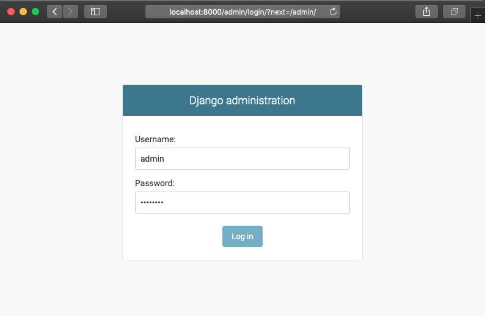
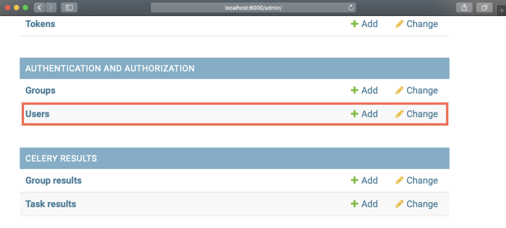
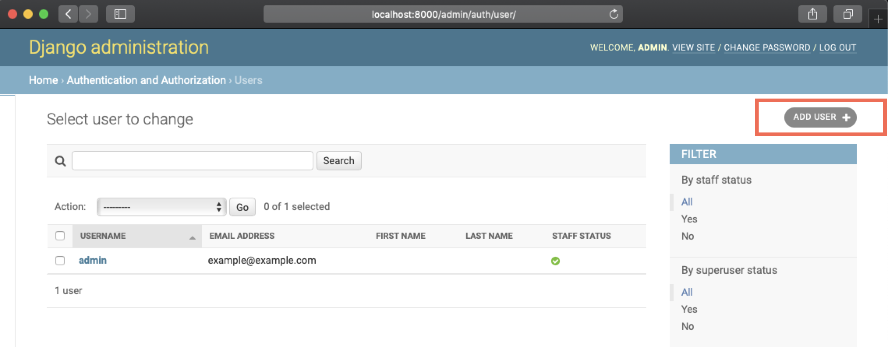
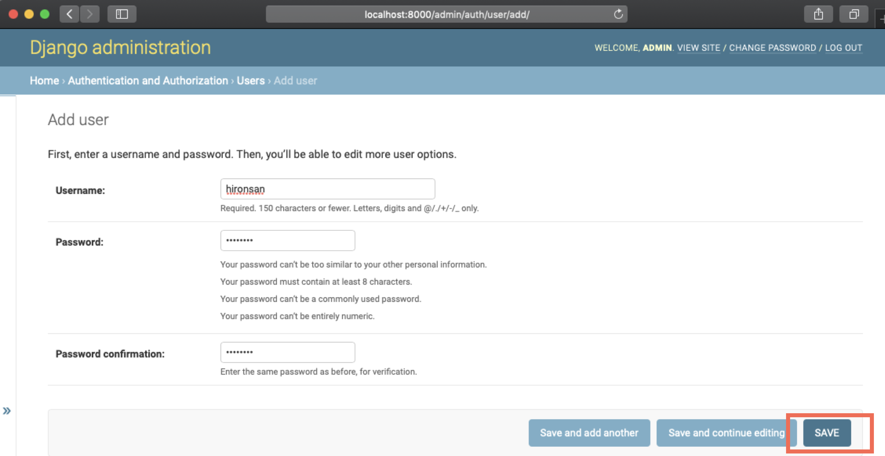
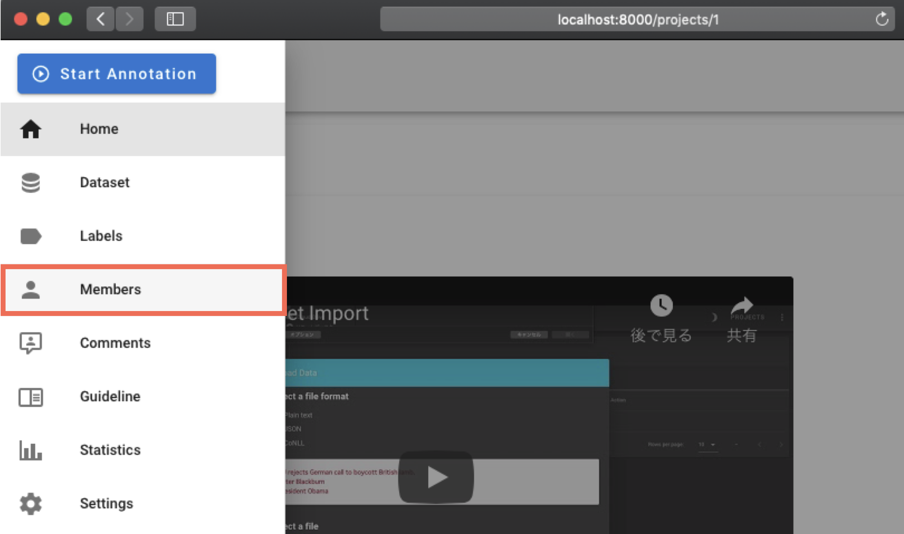
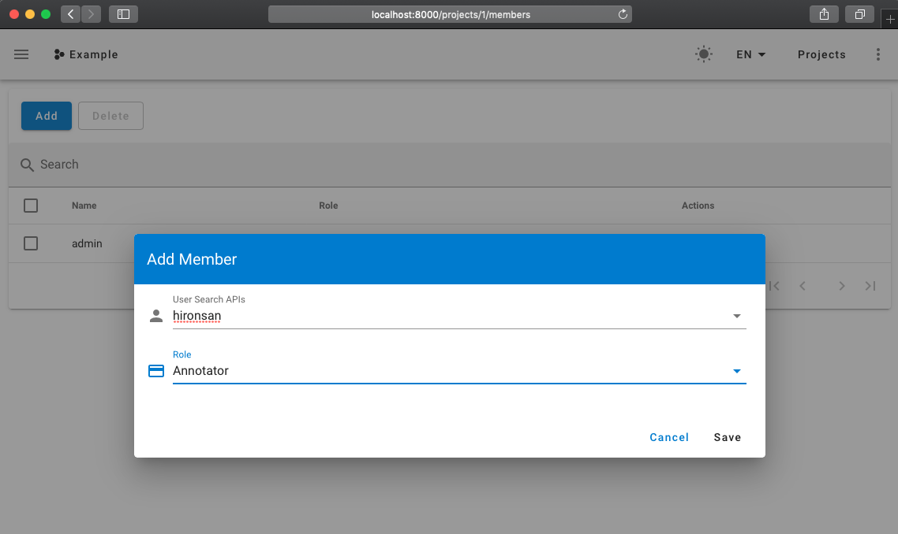

# FAQ

## How to create a user

After running doccano webserver, login to the admin site(in the case of pip installation) via <http://localhost:{port}/admin/>. The below is the example of port `8000` and username `admin`. If you set your own port or username and password on running the server, please change to your one.



After login to the admin site, select `Users`:



Select the ADD USER button in the upper right corner:



After entering the username and password for the new user, select the `SAVE` button:



Congratulations. Now you are able to log in to doccano as a new user. After logging out of the admin site, try logging in as a new user.

## How to add a user to your project

Note: This step assumes you have already created a new user. See [How to create a user](#how-to-create-a-user) in detail.

After logging in to doccano, select your project. Note that you must be the administrator of the project to add users to the project.

Select `Members` from the left side menu. If you are not the administrator of the project, `Members` will not be displayed.



Select the `Add` button to display the form. Fill in this form with the user name and role you want to add to the project. Then, select the `Save` button.



Congratulations. Now the new user are able to access the project.

## I can't upload my data

Please check the following list.

- File encoding: `UTF-8` is appropriate.
- Filename: alphabetic file name is suitable.
- File format selection: File format radio button should be selected properly.
- When you are using JSON/JSONL: Confirm JSON data is valid.
  - You can use [JSONLint](https://jsonlint.com/) or some other tool (when JSONL, pick one data and check it).
- When you are using CSV: Confirm CSV data is valid.
  - You can use Excel or some tools that have import CSV feature. 
- Lack of line: Data file should not contain blank line.
- Lack of field: Data file should not contain blank field.

**You don't need your real & all data to validate file format. The picked data & masked data is suitable if your data is large or secret.**

## I want to change user's or admin's password

For ordinary user:

1. Login to [Django Admin](https://djangobook.com/django-admin-site/) (URL: `/admin/`).
2. Open `Users` table.
3. Open user you want to change password.
4. In `Password` property, you'll see: `Raw passwords are not stored, so there is no way to see this user's password, but you can change the password using *this form*.` Click `this form` link.
5. Fill the form. Click `CHANGE PASSWORD` button.
6. **Logout from Django Admin site.** [You'll face login error without logout of Django Admin site](https://github.com/doccano/doccano/issues/723).

For the superuser account credentials, you have to set new password in the `docker-compose.dev.yml` and `docker-compose.prod.yml` files:

```yml
ADMIN_PASSWORD: "new_password"
```

## I want to change port number

On production, edit `docker-compose.prod.yml` file: change `80:80` substring in `nginx`/`ports` section to `<your_port>:80`.

On development, edit `docker-compose.dev.yml` file: change `8000:8000` substring in `backend`/`ports` section to `<your_port>:8000`.

## I want to update to the latest doccano image

1. Execute `git pull` to reflect the latest doccano.
2. Delete the volume that `doccano_node_modules`, `doccano_static_volume`, `doccano_venv` and `doccano_www`.
  **Do not delete `doccano_postgres_data` because it stores your projects data.**
3. Rebuild the doccano image.

The following commands are the procedure for 2~3.

```
❯ docker volume ls
DRIVER              VOLUME NAME
local               doccano_node_modules
local               doccano_postgres_data
local               doccano_static_volume
local               doccano_venv
local               doccano_www
❯ docker volume rm doccano_node_modules doccano_static_volume doccano_venv doccano_www
❯ docker-compose -f docker-compose.prod.yml build --no-cache
```
